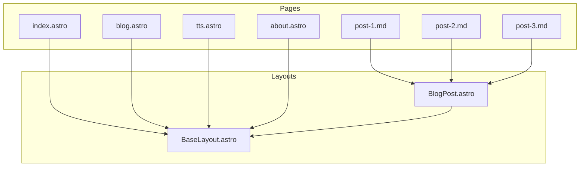

# Code Quality Improvements Plan

## Overview

This plan addresses four code quality issues identified in the codebase review. Per AGENTS.md rules (no mixing categories in a single branch), these are split into two branches:

| Branch | Category | Tasks |
|--------|----------|-------|
| `refactor/base-layout-ssr-to-static` | `refactor/` | Tasks 1, 2, 6 |
| `fix/mismatched-html-tag` | `fix/` | Task 4 |

---

## Branch 1: `refactor/base-layout-ssr-to-static`

### Task 1: Create `BaseLayout.astro`

**Goal:** Eliminate duplicated `<html>`, `<head>`, `<body>`, and `<Nav>` across all pages by creating a shared base layout.

**Files to create:**
- `app/src/layouts/BaseLayout.astro`

**Files to modify:**
- `app/src/pages/index.astro`
- `app/src/pages/blog.astro`
- `app/src/pages/tts.astro`
- `app/src/pages/about.astro`
- `app/src/layouts/BlogPost.astro`

**Steps:**

1. **Create `app/src/layouts/BaseLayout.astro`**
   - Accept props: `title`, `description?`, `activePage?`
   - Import `global.css`
   - Render `<html lang="en">`, `<head>` (with charset, viewport, title), `<body>`
   - Render `<Nav activePage={activePage} />`
   - Use `<slot />` for page-specific content

2. **Update `app/src/pages/index.astro`**
   - Import `BaseLayout` instead of manual html/head/body
   - Pass `title` and `activePage="/" ` as props
   - Move page-specific content into the layout slot
   - Remove direct `<html>`, `<head>`, `<body>`, `<Nav>` markup
   - Keep the `global.css` import in the layout only (remove from page)

3. **Update `app/src/pages/blog.astro`**
   - Import `BaseLayout`
   - Pass `title` and `activePage="/blog/"` as props
   - Move blog listing content into the layout slot
   - Remove direct `<html>`, `<head>`, `<body>`, `<Nav>` markup

4. **Update `app/src/pages/tts.astro`**
   - Import `BaseLayout`
   - Pass `title` and `activePage="/tts/"` as props
   - Import `tts.css` in the page (page-specific style)
   - Move `<TTS client:load />` into the layout slot
   - Remove direct `<html>`, `<head>`, `<body>`, `<Nav>` markup

5. **Update `app/src/pages/about.astro`**
   - Import `BaseLayout`
   - Pass `title` and `activePage="/about/"` as props
   - Move about page content into the layout slot
   - The inline `<style define:vars={...}>` block should remain in the page (page-specific styling)

6. **Update `app/src/layouts/BlogPost.astro`**
   - Import `BaseLayout` and wrap content with it
   - Pass `title` and any needed props to `BaseLayout`
   - Remove the outer `<html>`, `<head>`, `<body>` from `BlogPost.astro`
   - Keep the blog-post-specific CSS imports and article markup

**Architecture after changes:**

---

### Task 2: Switch from SSR to Static Output

**Goal:** Change Astro from server-side rendering to static site generation for simpler deployment and better performance.

**Files to modify:**
- `app/astro.config.mjs`
- `app/Dockerfile`
- `docker-compose.yml`
- `nginx/default.conf`

**Steps:**

1. **Update `app/astro.config.mjs`**
   - Change `output: 'server'` to `output: 'static'`
   - Remove the `adapter: node(...)` line (not needed for static output)
   - Keep `react()` integration (client-side components still work with static output)

2. **Update `app/Dockerfile`**
   - Change from running Node.js server to serving static files
   - Option A: Use nginx as the runtime image (multi-stage build)
   - Option B: Use `npx serve` or similar static file server
   - Recommended: Multi-stage build
     - Stage 1: Build the Astro app (node:24-alpine)
     - Stage 2: Copy `dist/` into nginx:alpine and serve
   - Remove `CMD ["node", "./dist/server/entry.mjs"]`
   - Remove `EXPOSE 3000` (or change to nginx port)

3. **Update `docker-compose.yml`**
   - Remove the `app` service (no longer needed as a separate container)
   - Update `nginx` service to mount the built static files directly
   - Keep `tunnel` service unchanged

4. **Update `nginx/default.conf`**
   - Change `proxy_pass http://app:3000` to serve static files directly
   - Use `root` and `index` directives pointing to the built `dist/` directory
   - Keep the `/api/voice` proxy pass unchanged (TTS API still needs proxying)

**Note:** The TTS page uses a React component with `client:load`. Astro's static output supports client-side components via hydration, so the TTS functionality will continue to work. The built output will include the necessary JavaScript bundles.

---

### Task 6: Deduplicate `Message` Interface

**Goal:** Remove the duplicate `Message` interface definition in [`TTS.tsx`](app/src/components/TTS.tsx:3) and import from the shared types file instead.

**Files to modify:**
- `app/src/components/TTS.tsx`

**Steps:**

1. **Update `app/src/components/TTS.tsx`**
   - Remove the inline `Message` interface definition (lines 3-8)
   - Add `import { Message } from '../types/tts';` at the top
   - The `TTSProps` interface can remain inline (it's component-specific)

2. **Verify `app/src/types/tts.d.ts`**
   - Confirm the `Message` interface export is correct (it already is: `export interface Message`)
   - No changes needed to the types file

---

## Branch 2: `fix/mismatched-html-tag`

### Task 4: Fix Mismatched HTML Tag in `index.astro`

**Goal:** Fix the malformed HTML tag where `</h3>` is used instead of `</a>`.

**Files to modify:**
- `app/src/pages/index.astro`

**Steps:**

1. **Update `app/src/pages/index.astro`**
   - Line 26: Change `</h3>` to `</a>`
   - Current: `<a href="https://github.com/sumomomomomo/sumomo-blog">Link to this blog's github repo</h3>`
   - Fixed: `<a href="https://github.com/sumomomomomo/sumomo-blog">Link to this blog's github repo</a>`

---

## Execution Order

1. **Branch `fix/mismatched-html-tag`** (Quick win, low risk)
   - Create branch from `main`
   - Fix the HTML tag
   - Commit, push, create PR

2. **Branch `refactor/base-layout-ssr-to-static`** (More complex, higher impact)
   - Create branch from `main`
   - Task 6 first (smallest change, reduces complexity for Task 1)
   - Task 1 next (creates the foundation for cleaner page structure)
   - Task 2 last (changes deployment architecture, depends on understanding the new layout structure)
   - Commit, push, create PR

---

## Risk Assessment

| Task | Risk | Mitigation |
|------|------|-----------|
| Task 1 (BaseLayout) | Medium | Thoroughly test all pages after refactoring |
| Task 2 (SSR to Static) | High | Test TTS client-side component hydration; verify nginx serves correctly |
| Task 4 (HTML fix) | Low | Simple one-line change |
| Task 6 (Deduplicate) | Low | Simple import change |
