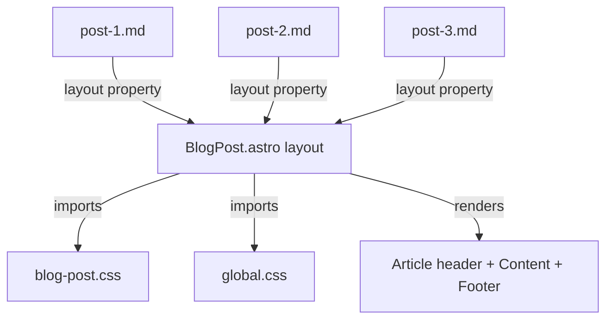

# Medium-Inspired Blog Post Styling Plan

## Design Proposal

This plan transforms the bare markdown blog posts into a clean, Medium-inspired reading experience with the following design principles:

### Visual Design

| Element | Style Choice |
|---|---|
| **Background** | Pure white (`#ffffff`) for the article card on a light gray page background |
| **Typography** | Serif body font (Georgia or system serif) for readability, matching Medium's editorial feel |
| **Article Width** | Max-width 68ch (~720px) for optimal reading line length |
| **Heading Style** | Bold, compact spacing, dark charcoal (`#242424`) |
| **Body Text** | Dark gray (`#2c2c2c`), 1.25rem base size, 1.75 line height |
| **Code Blocks** | Light gray background (`#f6f8fa`), monospace font, subtle border radius |
| **Blockquotes** | Left border accent (4px solid in brand color), italic, indented |
| **Links** | Underlined with a subtle blue (`#1a8917` - Medium green accent) |
| **Images** | Full-width within article, rounded corners, subtle shadow |
| **Tags** | Pill-shaped badges with light background |

### Article Header Section

Each post will feature a structured header:
- **Title**: Large, bold serif heading
- **Subtitle/Description**: Muted gray text below the title
- **Meta bar**: Author name, publish date, and reading time estimate
- **Cover image**: Full-width hero image from frontmatter (if available)

### Article Footer Section

- **Tags**: Displayed as pill-shaped badges
- **Divider**: Horizontal rule separating content from tags

## Architecture

## Implementation Steps

### Step 1: Create Blog Post Layout
- **File**: `app/src/layouts/BlogPost.astro`
- **Purpose**: Wrap markdown content with header, footer, and proper HTML structure
- **Structure**:
  - `<html>` with proper head (title, meta, charset, viewport)
  - Navigation links (reused from existing pages)
  - `<article>` element containing:
    - Cover image (from frontmatter)
    - Title (`<h1>`)
    - Description/subtitle
    - Meta info (author, date)
    - `{{content}}` slot for markdown body
    - Tags section
  - Import `global.css` and `blog-post.css`

### Step 2: Create Blog Post CSS
- **File**: `app/src/styles/blog-post.css`
- **Styles**:
  - `.blog-post` wrapper with max-width, centered layout, white background
  - `.blog-post-header` with title, description, and meta styling
  - `.blog-post-cover` for full-width hero images
  - `.blog-post-content` with typography rules for h1-h6, p, ul, ol, blockquote, code, pre, a, img, hr
  - `.blog-post-tags` with pill-style tag badges
  - Responsive adjustments for mobile viewports

### Step 3: Update Global CSS
- **File**: `app/src/styles/global.css`
- **Changes**:
  - Switch body font to serif (Georgia, Cambria, or system serif stack)
  - Improve base line-height and margins
  - Add smooth scroll behavior

### Step 4: Update Blog Posts
- **Files**: `post-1.md`, `post-2.md`, `post-3.md`
- **Change**: Add `layout: '@/layouts/BlogPost.astro'` to frontmatter of each post

### Step 5: Verify Responsive Design
- Ensure the layout works on:
  - Desktop (>1024px): Full article width with comfortable margins
  - Tablet (768px-1024px): Slightly reduced padding
  - Mobile (<768px): Full-width content with reduced font sizes

## File Changes Summary

| File | Action | Description |
|---|---|---|
| `app/src/layouts/BlogPost.astro` | Create | New layout component for blog posts |
| `app/src/styles/blog-post.css` | Create | Dedicated blog post styling |
| `app/src/styles/global.css` | Modify | Improved base typography |
| `app/src/pages/posts/post-1.md` | Modify | Add layout frontmatter |
| `app/src/pages/posts/post-2.md` | Modify | Add layout frontmatter |
| `app/src/pages/posts/post-3.md` | Modify | Add layout frontmatter |
