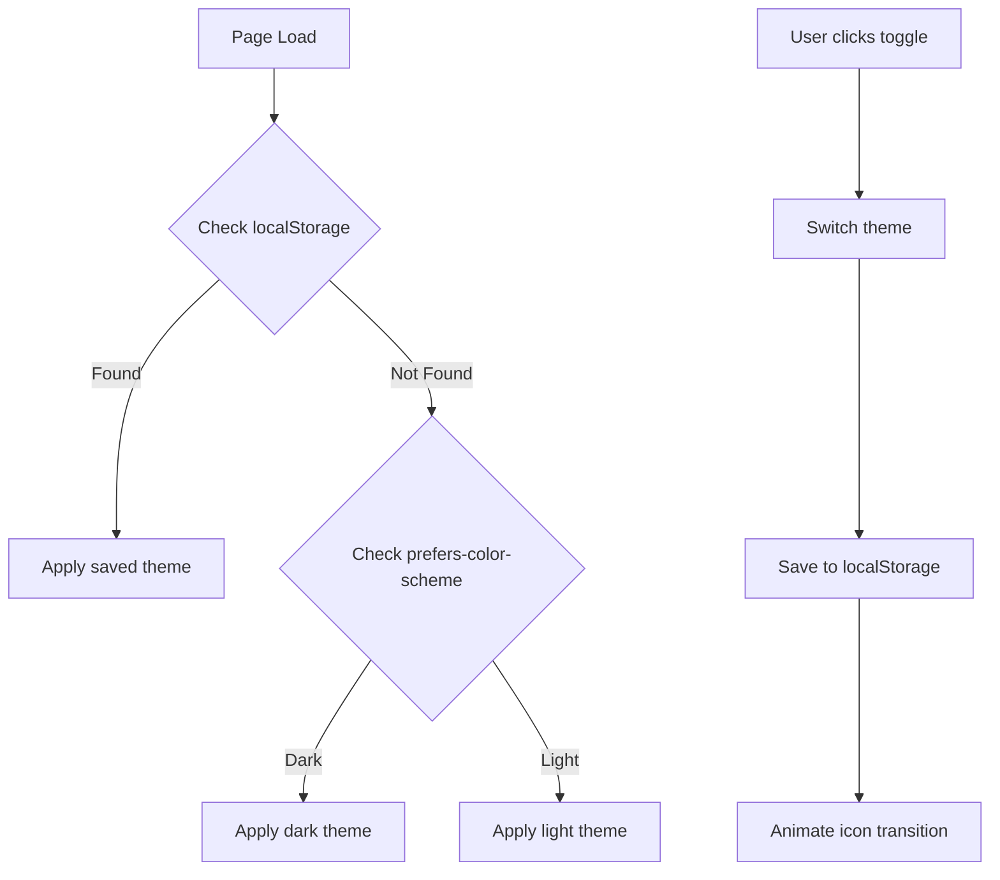
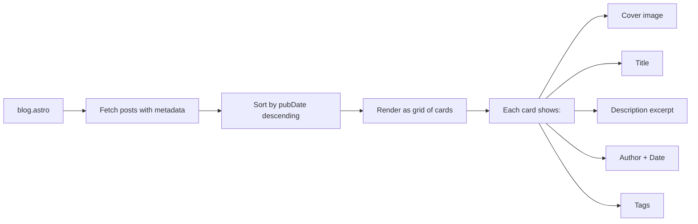

# Theme Toggle & Blog Cards - Implementation Plan

## Overview

This plan covers two features:
1. **Light/Dark Theme Toggle** - A toggle switch in the navigation bar with CSS animations, localStorage persistence, and browser preference detection.
2. **Blog Cards Display** - Redesign the `/blog` page to display posts as aesthetic cards instead of a simple list.

---

## Feature 1: Light/Dark Theme Toggle

### Architecture



### Implementation Details

#### A. CSS Custom Properties in global.css

Replace hardcoded colors with CSS custom properties on the `:root` selector, and define a `[data-theme="dark"]` override:

```css
:root {
  --bg-color: #f1f5f9;
  --text-color: #2c2c2c;
  --heading-color: #242424;
  --nav-bg: #ffffff;
  --nav-border: #e5e5e5;
  --nav-link-color: #242424;
  --nav-link-hover: #1a8917;
  --card-bg: #ffffff;
  --card-shadow: rgba(0, 0, 0, 0.08);
  --code-bg: #f6f8fa;
  --blockquote-bg: #f9f9f9;
  --tag-bg: #f0f0f0;
  --tag-color: #555;
  --scrollbar-track: #f1f5f9;
  --scrollbar-thumb: #cbd5e1;
  --divider: #e5e5e5;
}

[data-theme="dark"] {
  --bg-color: #0f172a;
  --text-color: #cbd5e1;
  --heading-color: #f1f5f9;
  --nav-bg: #1e293b;
  --nav-border: #334155;
  --nav-link-color: #cbd5e1;
  --nav-link-hover: #4ade80;
  --card-bg: #1e293b;
  --card-shadow: rgba(0, 0, 0, 0.3);
  --code-bg: #334155;
  --blockquote-bg: #1e293b;
  --tag-bg: #334155;
  --tag-color: #cbd5e1;
  --scrollbar-track: #1e293b;
  --scrollbar-thumb: #475569;
  --divider: #334155;
}
```

#### B. Update All Color References

Replace all hardcoded color values in global.css and blog-post.css with the corresponding CSS custom properties:
- `background-color: #f1f5f9` -> `background-color: var(--bg-color)`
- `color: #2c2c2c` -> `color: var(--text-color)`
- And so on for all color values

#### C. Theme Toggle Button in Nav.astro

Add a toggle button at the end of the nav bar:

```html
<button id="theme-toggle" class="theme-toggle" aria-label="Toggle dark mode">
  <span class="theme-icon sun-icon">
    <!-- Sun SVG icon -->
  </span>
  <span class="theme-icon moon-icon">
    <!-- Moon SVG icon -->
  </span>
</button>
```

**CSS for the toggle:**
- Circular button with smooth transition
- Sun icon visible in light mode, moon icon visible in dark mode
- CSS animation: rotate + scale transition when switching
- Icons cross-fade using opacity transitions

```css
.theme-toggle {
  background: none;
  border: none;
  cursor: pointer;
  padding: 0.5rem;
  position: relative;
  width: 40px;
  height: 40px;
  border-radius: 50%;
  transition: background-color 0.3s ease;
}

.theme-toggle:hover {
  background-color: var(--divider);
}

.theme-icon {
  position: absolute;
  top: 50%;
  left: 50%;
  transform: translate(-50%, -50%);
  transition: opacity 0.3s ease, transform 0.3s ease;
}

.sun-icon {
  opacity: 1;
  transform: translate(-50%, -50%) rotate(0deg) scale(1);
}

[data-theme="dark"] .sun-icon {
  opacity: 0;
  transform: translate(-50%, -50%) rotate(180deg) scale(0);
}

.moon-icon {
  opacity: 0;
  transform: translate(-50%, -50%) rotate(-180deg) scale(0);
}

[data-theme="dark"] .moon-icon {
  opacity: 1;
  transform: translate(-50%, -50%) rotate(0deg) scale(1);
}
```

#### D. JavaScript for Theme Management

Add inline script in BaseLayout.astro or Nav.astro:

```javascript
// On page load: determine initial theme
function getInitialTheme() {
  const saved = localStorage.getItem('theme');
  if (saved) return saved;
  return window.matchMedia('(prefers-color-scheme: dark)').matches ? 'dark' : 'light';
}

const theme = getInitialTheme();
document.documentElement.setAttribute('data-theme', theme);

// Toggle handler
document.getElementById('theme-toggle')?.addEventListener('click', () => {
  const current = document.documentElement.getAttribute('data-theme');
  const next = current === 'dark' ? 'light' : 'dark';
  document.documentElement.setAttribute('data-theme', next);
  localStorage.setItem('theme', next);
});

// Listen for system preference changes
window.matchMedia('(prefers-color-scheme: dark)').addEventListener('change', (e) => {
  if (!localStorage.getItem('theme')) {
    document.documentElement.setAttribute('data-theme', e.matches ? 'dark' : 'light');
  }
});
```

#### E. Prevent Flash of Unstyled Content (FOUC)

Add a small inline script in the `<head>` of BaseLayout.astro that runs before the page renders:

```html
<script is:inline>
  (function() {
    const theme = localStorage.getItem('theme') ||
      (window.matchMedia('(prefers-color-scheme: dark)').matches ? 'dark' : 'light');
    document.documentElement.setAttribute('data-theme', theme);
  })();
</script>
```

---

## Feature 2: Blog Cards Display

### Architecture



### Implementation Details

#### A. Update blog.astro

Enhance the post data extraction to include all frontmatter fields needed for rich cards:

```typescript
interface PostModule {
  id: string;
  metadata: {
    title: string;
    description?: string;
    author?: string;
    pubDate?: string;
    image?: { url: string; alt: string };
    tags?: string[];
  };
}

const postsRaw = import.meta.glob("./posts/*.md", { eager: true, query: "frontmatter" });

const posts: PostModule[] = Object.entries(postsRaw)
  .map(([path, mod]) => {
    const fileName = path.split("/").pop()?.replace(/\.md$/, "") ?? "";
    const moduleData = mod as any;
    const metadata = moduleData.frontmatter ?? moduleData.metadata ?? {};
    return {
      id: `posts/${fileName}`,
      metadata: {
        title: metadata.title ?? fileName,
        description: metadata.description ?? "",
        author: metadata.author ?? "",
        pubDate: metadata.pubDate ?? "",
        image: metadata.image,
        tags: metadata.tags ?? [],
      },
    };
  })
  .sort((a, b) => {
    const dateA = a.metadata.pubDate ? new Date(a.metadata.pubDate).getTime() : 0;
    const dateB = b.metadata.pubDate ? new Date(b.metadata.pubDate).getTime() : 0;
    return dateB - dateA;
  });
```

**Note:** Astro's `import.meta.glob` with `query: "frontmatter"` extracts only the frontmatter, which is more efficient. If this causes issues, fall back to `eager: true` and access `.frontmatter` property.

#### B. Card HTML Structure

```html
<div class="blog-grid">
  {posts.map((post) => (
    <a href={`/${post.id}`} class="blog-card">
      {post.metadata.image && (
        <div class="blog-card-image">
          
        </div>
      )}
      <div class="blog-card-content">
        <h2 class="blog-card-title">{post.metadata.title}</h2>
        {post.metadata.description && (
          <p class="blog-card-description">{post.metadata.description}</p>
        )}
        <div class="blog-card-meta">
          {post.metadata.author && (
            <span class="blog-card-author">{post.metadata.author}</span>
          )}
          {post.metadata.pubDate && (
            <span class="blog-card-date">
              {new Date(post.metadata.pubDate).toLocaleDateString('en-US', {
                year: 'numeric',
                month: 'long',
                day: 'numeric'
              })}
            </span>
          )}
        </div>
        {post.metadata.tags && post.metadata.tags.length > 0 && (
          <div class="blog-card-tags">
            {post.metadata.tags.map((tag: string) => (
              <span class="blog-card-tag">{tag}</span>
            ))}
          </div>
        )}
      </div>
    </a>
  ))}
</div>
```

#### C. Card CSS Styles

Add to global.css or a new `blog-cards.css` file:

```css
/* Blog Grid Layout */
.blog-grid {
  display: grid;
  grid-template-columns: repeat(auto-fill, minmax(320px, 1fr));
  gap: 2rem;
  margin-top: 2rem;
}

/* Blog Card */
.blog-card {
  display: flex;
  flex-direction: column;
  background-color: var(--card-bg);
  border-radius: 12px;
  box-shadow: 0 2px 8px var(--card-shadow);
  text-decoration: none;
  color: inherit;
  overflow: hidden;
  transition: transform 0.3s ease, box-shadow 0.3s ease;
}

.blog-card:hover {
  transform: translateY(-4px);
  box-shadow: 0 8px 24px var(--card-shadow);
}

/* Card Image */
.blog-card-image {
  width: 100%;
  height: 200px;
  overflow: hidden;
}

.blog-card-image img {
  width: 100%;
  height: 100%;
  object-fit: cover;
  transition: transform 0.3s ease;
}

.blog-card:hover .blog-card-image img {
  transform: scale(1.05);
}

/* Card Content */
.blog-card-content {
  padding: 1.5rem;
  display: flex;
  flex-direction: column;
  flex-grow: 1;
}

.blog-card-title {
  font-size: 1.25rem;
  font-weight: 700;
  color: var(--heading-color);
  margin: 0 0 0.75rem 0;
  line-height: 1.3;
}

.blog-card-description {
  font-size: 0.95rem;
  color: var(--text-color);
  line-height: 1.6;
  margin: 0 0 1rem 0;
  display: -webkit-box;
  -webkit-line-clamp: 3;
  -webkit-box-orient: vertical;
  overflow: hidden;
}

/* Card Meta */
.blog-card-meta {
  display: flex;
  gap: 1rem;
  font-size: 0.85rem;
  color: var(--text-color);
  opacity: 0.7;
  margin-top: auto;
}

/* Card Tags */
.blog-card-tags {
  display: flex;
  flex-wrap: wrap;
  gap: 0.5rem;
  margin-top: 1rem;
}

.blog-card-tag {
  display: inline-block;
  padding: 0.25rem 0.6rem;
  background-color: var(--tag-bg);
  color: var(--tag-color);
  border-radius: 20px;
  font-size: 0.8rem;
  font-weight: 500;
}

/* Responsive */
@media (max-width: 768px) {
  .blog-grid {
    grid-template-columns: 1fr;
    gap: 1.5rem;
  }
}
```

---

## Files to Modify

| File | Changes |
|------|---------|
| `app/src/styles/global.css` | Add CSS custom properties for theming, add blog card styles |
| `app/src/styles/blog-post.css` | Replace hardcoded colors with CSS variables |
| `app/src/components/Nav.astro` | Add theme toggle button with sun/moon icons |
| `app/src/layouts/BaseLayout.astro` | Add inline script for FOUC prevention |
| `app/src/pages/blog.astro` | Redesign with card grid layout, extract full frontmatter |

---

## Design Decisions

1. **CSS Custom Properties** - Using CSS variables allows clean theme switching without duplicating entire stylesheets. The `[data-theme="dark"]` selector on `html` provides a clean override mechanism.

2. **localStorage Key** - Using `'theme'` as the key for simplicity. Values are `'light'` or `'dark'`.

3. **Browser Preference Fallback** - Using `window.matchMedia('(prefers-color-scheme: dark)')` to detect system preference when no localStorage value exists.

4. **Card Grid** - Using CSS Grid with `auto-fill` and `minmax()` for responsive layout without media queries. Falls back to single column on mobile.

5. **Image Handling** - Cards with cover images show them; cards without images will display content-only. The `object-fit: cover` ensures consistent image sizing.

6. **Animation Approach** - CSS transitions on `transform` and `opacity` for smooth, GPU-accelerated animations. No JavaScript animation libraries needed.

7. **Frontmatter Extraction** - Using Astro's built-in frontmatter parsing. The `query: "frontmatter"` option is preferred for efficiency but may need adjustment based on Astro version compatibility.

---

## Testing Checklist

- [ ] Theme toggle switches between light and dark
- [ ] Theme persists after page reload
- [ ] Default theme matches browser preference on first visit
- [ ] No flash of wrong theme on page load (FOUC prevention)
- [ ] Sun/moon icons animate smoothly during toggle
- [ ] Blog cards display in responsive grid
- [ ] Cards show title, description, author, date, and tags
- [ ] Card hover effects work smoothly
- [ ] Blog posts are sorted by date (newest first)
- [ ] Dark mode applies correctly to all card elements
- [ ] Mobile responsive layout works correctly
